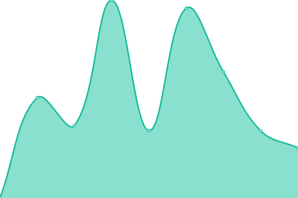
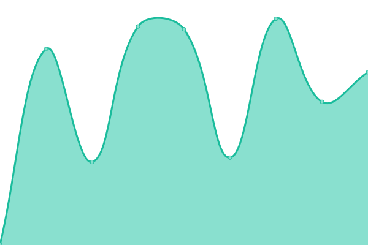
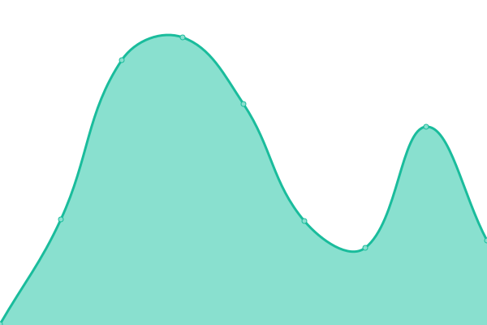
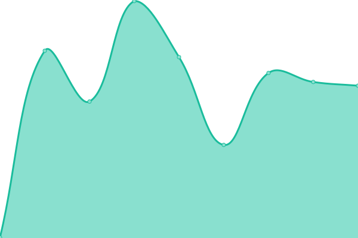
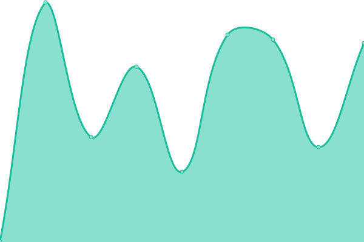

# [📈 Live Status](https://onuralpszr.github.io/uptime): <!--live status--> **🟧 Partial outage**

This repository contains the open-source uptime monitor and status page for [Onuralp SEZER](https://onuralpszr.github.io/uptime), powered by [Upptime](https://github.com/upptime/upptime).

With [Upptime](https://upptime.js.org), you can get your own unlimited and free uptime monitor and status page, powered entirely by a GitHub repository. We use [Issues](https://github.com/onuralpszr/uptime/issues) as incident reports, [Actions](https://github.com/onuralpszr/uptime/actions) as uptime monitors, and [Pages](https://onuralpszr.github.io/uptime) for the status page.

<!--start: status pages-->
<!-- This summary is generated by Upptime (https://github.com/upptime/upptime) -->
<!-- Do not edit this manually, your changes will be overwritten -->
<!-- prettier-ignore -->
| URL | Status | History | Response Time | Uptime |
| --- | ------ | ------- | ------------- | ------ |
|  [Personal Website](https://onuralpsezer.com) | 🟥 Down | [personal-website.yml](https://github.com/onuralpszr/uptime/commits/HEAD/history/personal-website.yml) | 

 110ms
     
 | 

<a href="https://status.onuralpsezer.com/history/personal-website">0.00%</a>
    

|  [RPMFusion](https://rpmfusion.org/) | 🟩 Up | [rpm-fusion.yml](https://github.com/onuralpszr/uptime/commits/HEAD/history/rpm-fusion.yml) | 

 1210ms
     
 | 

<a href="https://status.onuralpsezer.com/history/rpm-fusion">100.00%</a>
    

|  [Start Fedora Project](https://start.fedoraproject.org/) | 🟩 Up | [start-fedora-project.yml](https://github.com/onuralpszr/uptime/commits/HEAD/history/start-fedora-project.yml) | 

 1013ms
     
 | 

<a href="https://status.onuralpsezer.com/history/start-fedora-project">100.00%</a>
    

|  [Pagure.io](https://pagure.io/) | 🟩 Up | [pagure-io.yml](https://github.com/onuralpszr/uptime/commits/HEAD/history/pagure-io.yml) | 

 648ms
     
 | 

<a href="https://status.onuralpsezer.com/history/pagure-io">100.00%</a>
    

|  [openSUSE Bar](https://meet.opensuse.org/) | 🟩 Up | [open-suse-bar.yml](https://github.com/onuralpszr/uptime/commits/HEAD/history/open-suse-bar.yml) | 

 1384ms
     
 | 

<a href="https://status.onuralpsezer.com/history/open-suse-bar">100.00%</a>
    

|  [element.io](https://app.element.io/) | 🟩 Up | [element-io.yml](https://github.com/onuralpszr/uptime/commits/HEAD/history/element-io.yml) | 

 457ms
     
 | 

<a href="https://status.onuralpsezer.com/history/element-io">100.00%</a>
    

|  [Fedora Chat Matrix](https://chat.fedoraproject.org/) | 🟩 Up | [fedora-chat-matrix.yml](https://github.com/onuralpszr/uptime/commits/HEAD/history/fedora-chat-matrix.yml) | 

 330ms
     
 | 

<a href="https://status.onuralpsezer.com/history/fedora-chat-matrix">100.00%</a>
    

|  [CentOS Koji](https://koji.mbox.centos.org/koji/) | 🟩 Up | [cent-os-koji.yml](https://github.com/onuralpszr/uptime/commits/HEAD/history/cent-os-koji.yml) | 

 378ms
     
 | 

<a href="https://status.onuralpsezer.com/history/cent-os-koji">100.00%</a>
    

|  [Fedora Koji](https://koji.fedoraproject.org/koji/) | 🟩 Up | [fedora-koji.yml](https://github.com/onuralpszr/uptime/commits/HEAD/history/fedora-koji.yml) | 

 5546ms
     
 | 

<a href="https://status.onuralpsezer.com/history/fedora-koji">100.00%</a>
    

|  [Github Stats](https://ghstats.onuralpsezer.com/) | 🟩 Up | [github-stats.yml](https://github.com/onuralpszr/uptime/commits/HEAD/history/github-stats.yml) | 

 1986ms
     
 | 

<a href="https://status.onuralpsezer.com/history/github-stats">100.00%</a>
    

|  [GDGSamsun Website](https://gdgsamsun.org) | 🟩 Up | [gdg-samsun-website.yml](https://github.com/onuralpszr/uptime/commits/HEAD/history/gdg-samsun-website.yml) | 

 208ms
     
 | 

<a href="https://status.onuralpsezer.com/history/gdg-samsun-website">100.00%</a>
    

<!--end: status pages-->

[**Visit our status website →**](https://onuralpszr.github.io/uptime)

## 📄 License

- Powered by: [Upptime](https://github.com/upptime/upptime)
- Code: [MIT](./LICENSE) © [Onuralp SEZER](https://onuralpszr.github.io/uptime)
- Data in the `./history` directory: [Open Database License](https://opendatacommons.org/licenses/odbl/1-0/)
